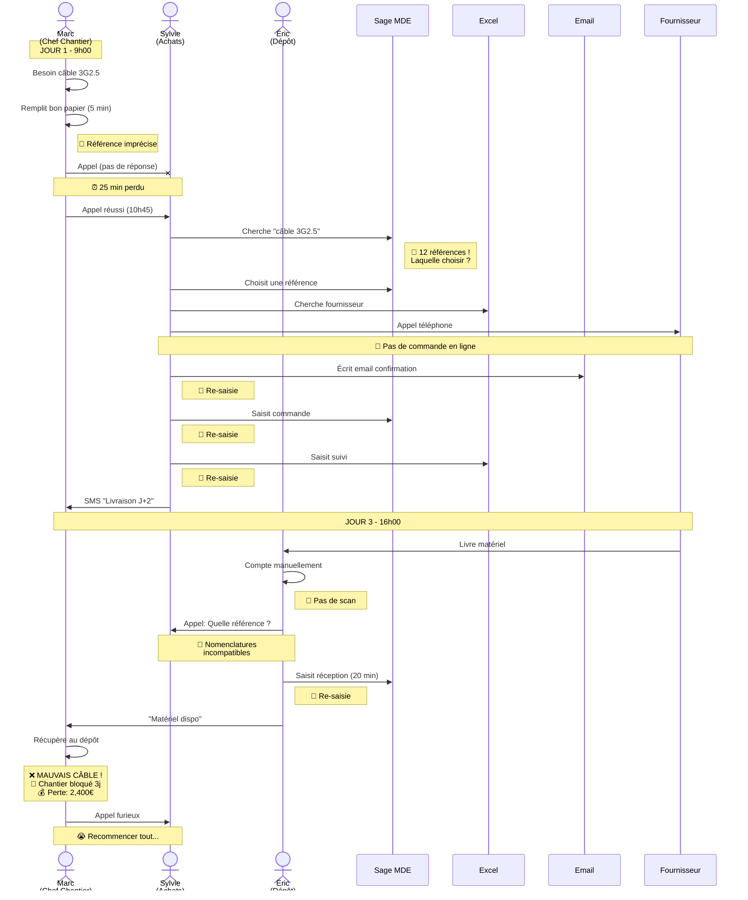
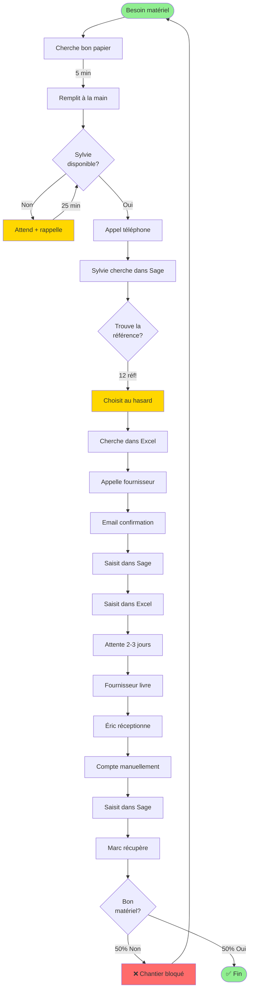
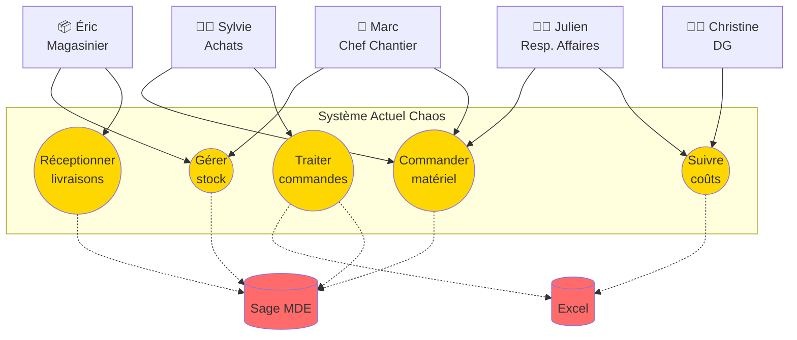
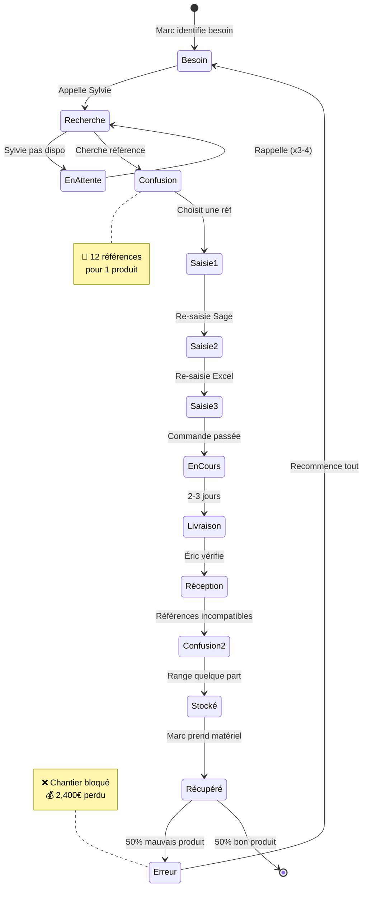
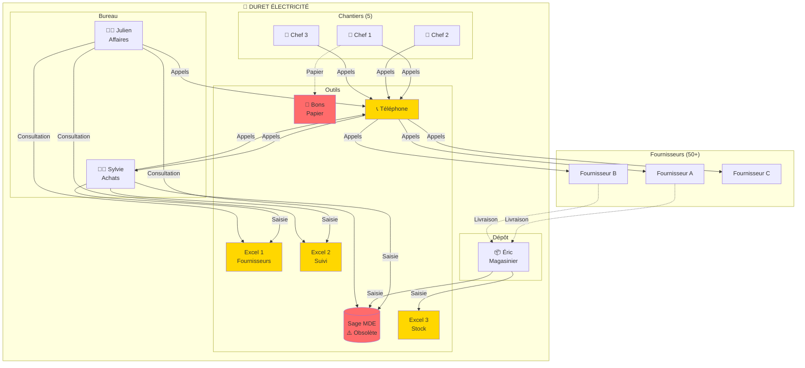
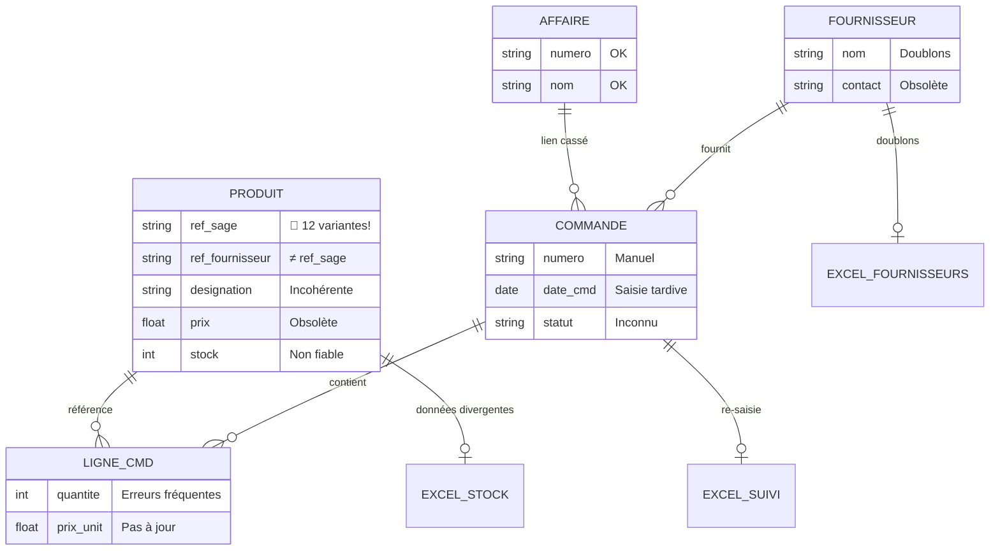
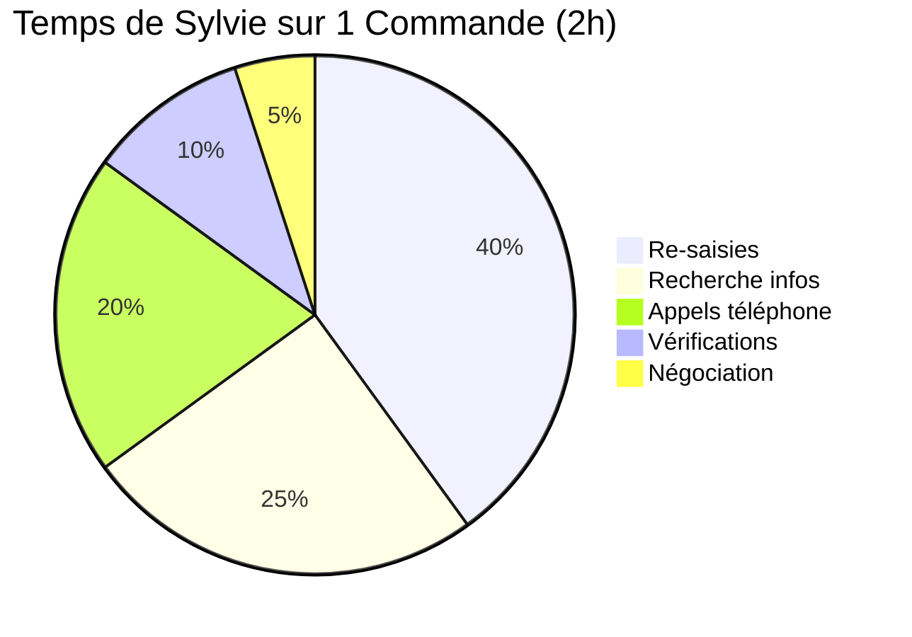
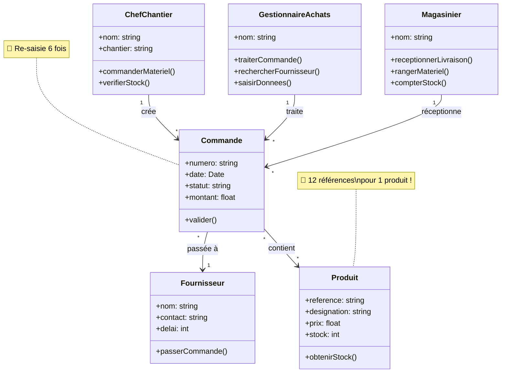
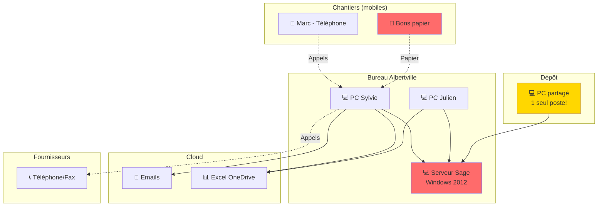

# 🎨 DIAGRAMMES UML - Achats-Logistique

> Diagrammes visuels pour présentation slides
> Format: Mermaid (rendu graphique)

---

## 1. Diagramme de Séquence: Commande de Matériel (État ACTUEL)

---

## 2. Activity Diagram: Processus Commande ACTUEL

---

## 3. Use Case Diagram: Acteurs et Actions

---

## 4. State Diagram: Cycle de Vie d'une Commande

---

## 5. Component Diagram: Architecture Système ACTUEL

---

## 6. ERD: Chaos de la Base de Données

---

## 7. Pie Chart: Répartition du Temps (Sylvie)

---

## 8. Gantt: Timeline d'une Commande

```mermaid
gantt
    title Commande Câble: Du Besoin à la Livraison
    dateFormat HH:mm
    axisFormat %Hh%M

    section Marc
    Identifie besoin           :done, m1, 09:00, 5m
    Cherche bon papier         :done, m2, after m1, 5m
    Remplit bon                :done, m3, after m2, 5m
    Essaie joindre Sylvie      :crit, m4, after m3, 25m
    Appel Sylvie               :done, m5, 10:45, 10m
    Attente livraison          :crit, m6, 11:00, 2880m
    Récupère matériel          :done, m7, 14:00, 30m
    Découvre erreur            :crit, m8, after m7, 1m

    section Sylvie
    Reçoit appel               :done, s1, 10:45, 10m
    Cherche dans Sage          :done, s2, after s1, 12m
    Cherche fournisseur        :done, s3, after s2, 8m
    Appel fournisseur          :done, s4, after s3, 15m
    Email confirmation         :done, s5, after s4, 10m
    Saisit Sage                :done, s6, after s5, 5m
    Saisit Excel               :done, s7, after s6, 5m

    section Éric
    Réception livraison        :done, e1, 09:00, 60m
    Saisit dans Sage           :done, e2, after e1, 20m
```

---

## 9. Class Diagram: Modèle Objet (Simplifié)

---

## 10. Deployment Diagram: Infrastructure Actuelle

---

**LÉGENDE**

🔴 = Pain Point CRITIQUE
🟠 = Pain Point IMPORTANT
🟢 = Pain Point SOUHAITÉ
⏰ = Temps perdu
❌ = Erreur
💰 = Coût financier
