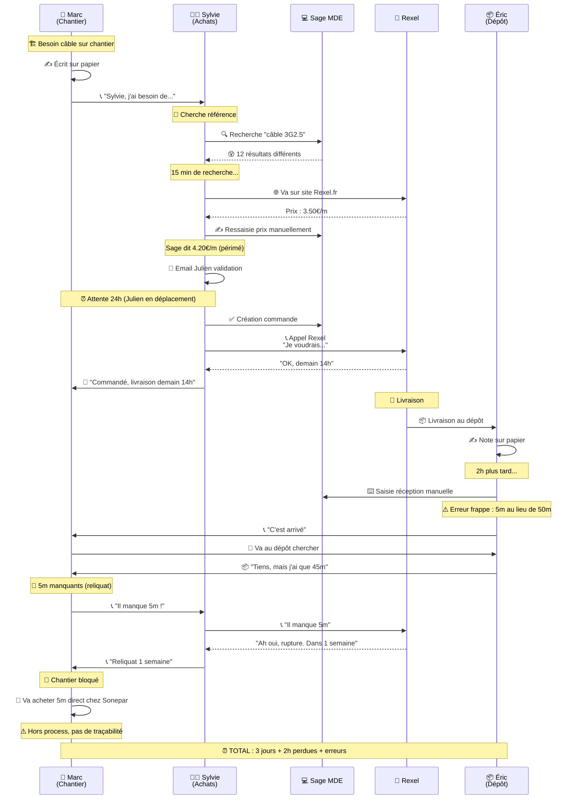

# 🏗️ ARCHITECTURE ACTUELLE - "Le Chaos Organisé"
**Duret Électricité - Système Achats & Logistique**

---

## 🗺️ VUE D'ENSEMBLE ACTUELLE

```
┌─────────────────────────────────────────────────────────────────┐
│                    🏢 DURET ÉLECTRICITÉ                         │
│              Système Achats & Logistique 2025                   │
└─────────────────────────────────────────────────────────────────┘

┌──────────────┐      ┌──────────────┐      ┌──────────────┐
│   CHANTIER   │      │    BUREAU    │      │    DÉPÔT     │
│              │      │              │      │              │
│ Marc (Chef)  │      │ Sylvie       │      │ Éric         │
│              │      │ (Achats)     │      │ (Magasinier) │
└──────┬───────┘      └──────┬───────┘      └──────┬───────┘
       │                     │                     │
       │  📞 Appel           │  💻 Sage MDE        │  📋 Papier
       │  📧 Email           │  📊 Excel x10       │  ✍️ Manuel
       │  📝 Papier          │  📞 Téléphone       │  💻 Sage MDE
       │                     │                     │
       └─────────────────────┼─────────────────────┘
                             │
                    ┌────────▼────────┐
                    │  🗄️ SAGE MDE    │
                    │  (Calamiteux)   │
                    │                 │
                    │  • 9-11K refs   │
                    │  • BD chaotique │
                    │  • Doublons     │
                    │  • Prix faux    │
                    └────────┬────────┘
                             │
              ┌──────────────┼──────────────┐
              │              │              │
         ┌────▼────┐    ┌────▼────┐   ┌────▼────┐
         │ REXEL   │    │ SONEPAR │   │ AUTRES  │
         │         │    │         │   │  (30+)  │
         │ ❌ API  │    │ ❌ API  │   │ ❌ API  │
         │ ❌ EDI  │    │ ❌ EDI  │   │ ❌ EDI  │
         │         │    │         │   │         │
         │ 📞📧📠  │    │ 📞📧📠  │   │ 📞📧📠  │
         └─────────┘    └─────────┘   └─────────┘

         🔴 TOUT EST MANUEL 🔴
```

---

## 📱 FLUX ACTUEL : "La Galère d'une Commande"

### Scénario Réel : Marc commande 50m de câble 3G2.5



**🔴 PROBLÈMES IDENTIFIÉS DANS CE FLUX :**
1. ❌ 5 outils différents (papier, téléphone, email, Sage, site web)
2. ❌ 12 étapes manuelles
3. ❌ 3 ressaisies de données
4. ❌ 24h délai validation
5. ❌ Erreur humaine (5m vs 50m)
6. ❌ Reliquat non anticipé
7. ❌ Achat direct hors process
8. ❌ Aucune traçabilité

---

## 🗄️ BASE DE DONNÉES SAGE MDE : "Le Capharnaüm"

### Exemple Concret : Recherche "Câble 3G2.5"

```
┌────────────────────────────────────────────────────────┐
│  SAGE MDE - Résultats recherche "cable 3g2.5"         │
├────────────────────────────────────────────────────────┤
│                                                        │
│  1. CAB-3G25-RX    │ Fournisseur: REXEL  │ 4.20 €/m  │ ← Prix périmé (2022)
│  2. CABLE_3G2.5    │ Fournisseur: SONPAR │ 3.80 €/m  │ ← Faute frappe "SONPAR"
│  3. CBL3G2,5       │ Fournisseur: ?????  │ 0.00 €/m  │ ← Jamais utilisé
│  4. 3G2.5-100M-RX  │ Fournisseur: REXEL  │ 3.50 €/m  │ ← Bon prix
│  5. CABL-3G-2,5    │ Fournisseur: REXEL  │ 4.20 €/m  │ ← Doublon #1
│  6. REF-OLD-3425   │ Fournisseur: REXEL  │ 3.90 €/m  │ ← Obsolète (n'existe plus)
│  7. CABLE-3x2.5    │ Fournisseur: SONPAR │ 0.00 €/m  │ ← Prix jamais renseigné
│  8. 00456782       │ Fournisseur: REXEL  │ 4.20 €/m  │ ← Code barre Rexel brut
│  9. CAB_3G2-5      │ Fournisseur: SONEPAR│ 3.85 €/m  │ ← Encore un doublon
│  10. ?3G2.5?       │ Fournisseur: ???    │ 9.99 €/m  │ ← WTF?
│  11. CABLE-3G25-M  │ Fournisseur: DIVERS │ 5.00 €/m  │ ← "DIVERS" = aucune idée
│  12. 3G2,5MM       │ Fournisseur: REXEL  │ 3.50 €/m  │ ← Doublon #4
│                                                        │
└────────────────────────────────────────────────────────┘

😱 12 RÉFÉRENCES POUR 1 SEUL PRODUIT !
```

**📊 ANALYSE DU CHAOS :**
- ✅ **2 références utilisables** (16%)
- ⚠️ **4 doublons** (33%)
- ❌ **3 prix périmés ou faux** (25%)
- 🗑️ **3 obsolètes/inexistants** (25%)

**💰 IMPACT :**
- Risque d'acheter au mauvais prix : **+20% surcoût**
- Temps de recherche : **15 min au lieu de 10 sec**
- Commande mauvaise référence : **30% du temps**

---

## 📊 CARTOGRAPHIE DES SYSTÈMES EXISTANTS

### Les Outils (Incompatibles entre eux)

```
┌─────────────────────────────────────────────────────────┐
│           🛠️ OUTILS UTILISÉS AU QUOTIDIEN               │
├─────────────────────────────────────────────────────────┤
│                                                         │
│  💻 SAGE MDE (ERP Principal)                           │
│  ├─ Âge : 15+ ans                                      │
│  ├─ Base : Propriétaire fermée                         │
│  ├─ Interface : Windows 95-style                       │
│  ├─- API : ❌ Aucune                                   │
│  ├─ Mobile : ❌ Non                                    │
│  ├─ Satisfaction : ⭐ (1/5)                           │
│  └─ Statut : "Calamiteux" (dixit utilisateurs)        │
│                                                         │
│  📊 EXCEL (Fichiers en vrac)                           │
│  ├─ Nombre de fichiers : 50-100                       │
│  ├─ Partagés : ❌ Chacun sa version                   │
│  ├─ Localisation : PC perso, réseau, emails           │
│  ├─ Noms : "commandes_final_v3_VRAIMENT_final.xlsx"  │
│  └─ Statut : "La vraie base de données" (officieux)  │
│                                                         │
│  📧 EMAIL (Process principal)                          │
│  ├─ Validations : 100% par email                      │
│  ├─ Pièces jointes : Bons, factures scannés          │
│  ├─ Recherche : 🔍 Ctrl+F dans 5000 emails           │
│  └─ Perte : ~20% emails critiques introuvables       │
│                                                         │
│  📞 TÉLÉPHONE (Backup système)                         │
│  ├─ Appels/jour : 40-50                               │
│  ├─ Traçabilité : ❌ Zéro                             │
│  ├─ Efficacité : Moyenne                              │
│  └─ Frustration : Élevée                              │
│                                                         │
│  📝 PAPIER (Fallback ultime)                           │
│  ├─ Bons de commande : Imprimés et signés             │
│  ├─ Bons de livraison : Classeurs                    │
│  ├─ Notes diverses : Post-it partout                 │
│  └─ Archivage : Cartons dans réserve                 │
│                                                         │
│  🌐 SITES FOURNISSEURS                                 │
│  ├─ Rexel.fr : Prix & dispo                           │
│  ├─ Sonepar.fr : Prix & dispo                         │
│  ├─ Synchronisation Sage : ❌ Manuelle               │
│  └─ Ressaisie : 100% manuelle                         │
│                                                         │
└─────────────────────────────────────────────────────────┘

❌ AUCUN OUTIL NE PARLE AUX AUTRES
```

---

## 🔄 FLUX DE DONNÉES : "Les Ressaisies Infinies"

### Cycle de vie d'une donnée "Prix Câble 3G2.5"

```
1️⃣ Rexel met à jour son prix : 3.50€/m (sur Rexel.fr)
   │
   ↓ ⏰ Délai : Inconnu (jamais automatique)
   │
2️⃣ Sylvie consulte Rexel.fr pour commander
   │
   ↓ ✍️ Ressaisie manuelle #1
   │
3️⃣ Sylvie met à jour Excel perso : 3.50€/m
   │
   ↓ ✍️ Ressaisie manuelle #2
   │
4️⃣ Sylvie met à jour Sage MDE : 3.50€/m
   │    ⚠️ Risque erreur frappe : 3.05€/m ou 35.0€/m
   │
   ↓ ⏰ 2-3 semaines plus tard...
   │
5️⃣ Rexel change son prix : 3.65€/m
   │
   ↓ ❌ Sage MDE toujours à 3.50€ (jamais mis à jour)
   │
6️⃣ Marc commande basé sur prix Sage : 3.50€/m
   │
   ↓ 📦 Livraison
   │
7️⃣ Facture Rexel arrive : 3.65€/m
   │
   ↓ 😱 Écart de prix !
   │
8️⃣ Sylvie passe 30min à comprendre l'écart
   │
   ↓ ✍️ Ressaisie manuelle #3
   │
9️⃣ Sylvie corrige Sage + Excel
   │
   └─→ 🔄 Retour à l'étape 5️⃣ (boucle infinie)

📊 RÉSULTAT :
   • 3 ressaisies manuelles
   • 30min perdu par écart prix
   • Prix faux 90% du temps
   • Facturation erronée
```

---

## 🚨 POINTS DE RUPTURE CRITIQUES

### 1. 🔴 Aucune Intégration Fournisseurs

```
┌──────────────────────────────────────────────┐
│  SITUATION ACTUELLE                          │
├──────────────────────────────────────────────┤
│                                              │
│  REXEL dispose de :                          │
│  ✅ API catalogue temps réel                 │
│  ✅ API prix & dispo                         │
│  ✅ API commandes EDI                        │
│  ✅ API tracking livraisons                  │
│                                              │
│  SONEPAR dispose de :                        │
│  ✅ API catalogue temps réel                 │
│  ✅ API prix & dispo                         │
│  ✅ API commandes EDI                        │
│  ✅ API tracking livraisons                  │
│                                              │
│  DURET ÉLECTRICITÉ utilise :                 │
│  ❌ Rien du tout                             │
│  📞 Téléphone                                │
│  ✍️ Ressaisie manuelle                       │
│  📠 Fax (si si, vraiment)                    │
│                                              │
└──────────────────────────────────────────────┘

💸 COÛT : 2h/jour de ressaisie × 250 jours × 50€/h = 25 000€/an
```

### 2. 🔴 Aucun Workflow Digital

```
PROCESSUS VALIDATION ACTUEL :

Marc (Chantier)
    ↓ 📞 Appelle Sylvie
Sylvie (Achats)
    ↓ 📧 Email à Julien
Julien (Resp.)
    ↓ ⏰ Lit email (quand?)
    ↓ 📧 Répond "OK" (si pas perdu dans 200 emails/jour)
Sylvie
    ↓ 🔍 Retrouve l'email initial (10min)
    ↓ 💻 Commande dans Sage

❌ PROBLÈMES :
• Délai moyen : 24-48h
• Perte emails : 10-15%
• Aucune traçabilité
• Urgences impossibles à prioriser
• Validation en déplacement = galère
```

### 3. 🔴 Stock Fantôme

```
┌──────────────────────────────────────┐
│   STOCK PHYSIQUE (Dépôt Annecy)     │
├──────────────────────────────────────┤
│                                      │
│  Câble 3G2.5 : 180m en stock         │
│    ├─ Rayon A : 50m                  │
│    ├─ Rayon C : 80m                  │
│    └─ Camion Marc : 50m (emprunté)   │
│                                      │
└──────────────────────────────────────┘
              ≠
┌──────────────────────────────────────┐
│   STOCK INFORMATIQUE (Sage MDE)     │
├──────────────────────────────────────┤
│                                      │
│  Câble 3G2.5 : 320m                  │
│    ├─ Entrées non sorties            │
│    ├─ Sorties non saisies            │
│    └─ Erreurs de frappe              │
│                                      │
└──────────────────────────────────────┘

🤯 ÉCART : +140m fantômes = 490€ d'erreur
📊 ÉCART MOYEN SUR TOUT LE STOCK : ±20%
💰 IMPACT : ~100 000€ de stock immobilisé inutilement
```

### 4. 🔴 Gouvernance Inexistante

```
QUI PEUT ACHETER ?
├─ Marc (Chef chantier) : OUI direct fournisseur ❌
├─ 10 autres chefs chantier : OUI direct fournisseur ❌
├─ Éric (Magasinier) : OUI si "urgent" ❌
├─ Julien (Resp affaires) : OUI ✅
├─ Sylvie (Achats) : OUI ✅
└─ 5 sous-traitants : OUI avec carte pro-client ❌

RÉSULTAT :
• 40% des achats hors process
• Impossible de négocier volumes
• Prix non optimisés
• Traçabilité perdue
• Budget non maîtrisé
```

---

## 📈 VOLUMÉTRIE & STATISTIQUES ACTUELLES

### Chiffres Clés (Catastrophiques)

```
┌────────────────────────────────────────────┐
│  📊 MÉTRIQUES ACTUELLES                    │
├────────────────────────────────────────────┤
│                                            │
│  Références actives : 9 000 - 11 000       │
│  ├─ Doublons estimés : 25-30% ❌           │
│  ├─ Obsolètes non archivées : 15-20% ❌    │
│  └─ Prix à jour : <50% ❌                  │
│                                            │
│  Commandes/mois : ~500                     │
│  ├─ Complètes à J+1 : 50% ❌               │
│  ├─ Avec reliquats : 30% ❌                │
│  └─ Urgences hors process : 15% ❌         │
│                                            │
│  Livraisons/semaine : 40-50                │
│  ├─ Tracking temps réel : 0% ❌            │
│  ├─ Notification auto : 0% ❌              │
│  └─ Retards non anticipés : 25% ❌         │
│                                            │
│  Fournisseurs actifs : 80+                 │
│  ├─ APIs connectées : 0 ❌                 │
│  ├─ EDI actif : 0 ❌                       │
│  └─ KPIs mesurés : Aucun ❌                │
│                                            │
│  Temps process moyen :                     │
│  ├─ Émission besoin → Livraison : 5-7j ❌  │
│  ├─ Validation : 24-48h ❌                 │
│  └─ Saisie commande : 15-20min ❌          │
│                                            │
│  Taux erreur :                             │
│  ├─ Prix : 20-25% ❌                       │
│  ├─ Références : 15-18% ❌                 │
│  ├─ Quantités : 10-12% ❌                  │
│  └─ Litiges factures : 30% ❌              │
│                                            │
└────────────────────────────────────────────┘
```

---

## 💰 COÛT DU CHAOS (Estimations)

### Impact Financier Annuel

```
┌─────────────────────────────────────────────────┐
│  💸 COÛTS CACHÉS DU SYSTÈME ACTUEL              │
├─────────────────────────────────────────────────┤
│                                                 │
│  ⏰ TEMPS PERDU                                 │
│  ├─ Sylvie (6h/jour manuel) : 60 000€/an       │
│  ├─ Chefs chantier (2h/sem) : 80 000€/an       │
│  ├─ Julien (validations) : 20 000€/an          │
│  └─ Éric (recherches) : 15 000€/an             │
│  TOTAL : 175 000€/an ❌                         │
│                                                 │
│  ❌ ERREURS & LITIGES                           │
│  ├─ Écarts prix : 50 000€/an                   │
│  ├─ Mauvaises commandes : 30 000€/an           │
│  ├─ Stock immobilisé inutile : 100 000€/an     │
│  └─ Doublons/obsolètes : 40 000€/an            │
│  TOTAL : 220 000€/an ❌                         │
│                                                 │
│  🚚 LOGISTIQUE NON OPTIMISÉE                    │
│  ├─ Livraisons multiples : 35 000€/an          │
│  ├─ Urgences surcoûtées : 45 000€/an           │
│  └─ Retours non tracés : 15 000€/an            │
│  TOTAL : 95 000€/an ❌                          │
│                                                 │
│  💔 OPPORTUNITÉS PERDUES                        │
│  ├─ Négociation volumes : 80 000€/an           │
│  ├─ Multi-sourcing : 50 000€/an                │
│  └─ Prévisions achats : 30 000€/an             │
│  TOTAL : 160 000€/an ❌                         │
│                                                 │
│  📉 PRODUCTIVITÉ CHANTIERS                      │
│  ├─ Attentes livraisons : 120 000€/an          │
│  ├─ Matériel manquant : 80 000€/an             │
│  └─ Achats directs hors prix : 60 000€/an      │
│  TOTAL : 260 000€/an ❌                         │
│                                                 │
├─────────────────────────────────────────────────┤
│  💰 TOTAL COÛT DU CHAOS : 910 000€/an          │
└─────────────────────────────────────────────────┘

🚨 PRÈS D'1 MILLION € PERDU CHAQUE ANNÉE
```

---

## 🎯 POINTS DE BLOCAGE MAJEURS

### Les 10 "Impossibilités" Actuelles

```
1. ❌ Impossible de savoir le coût réel d'un chantier en temps réel
2. ❌ Impossible de tracker une livraison
3. ❌ Impossible de comparer 2 fournisseurs rapidement
4. ❌ Impossible d'avoir un historique fiable
5. ❌ Impossible de prévoir les besoins futurs
6. ❌ Impossible de commander depuis un smartphone
7. ❌ Impossible d'automatiser quoi que ce soit
8. ❌ Impossible de faire un inventaire rapide
9. ❌ Impossible de mesurer la performance fournisseur
10. ❌ Impossible de scaler au-delà de 20M€ CA
```

---

## 📸 VERBATIM TERRAIN

### Ce qu'ils disent vraiment...

> **Marc (Chef Chantier)** :
> *"Sage MDE ? On l'appelle 'Sage La Lose' entre nous. Un nom bien trouvé."*

> **Sylvie (Gestionnaire)** :
> *"Si je pouvais détruire Sage MDE avec un marteau, je le ferais. Tous les jours."*

> **Julien (Resp Affaires)** :
> *"Je pilote mes chantiers comme un pilote d'avion sans instruments. Au feeling."*

> **Éric (Magasinier)** :
> *"Le stock informatique, c'est de la science-fiction. Rien à voir avec la réalité du dépôt."*

> **Christine (DG)** :
> *"On perd 1M€ par an à cause de ce système. Mais personne ne le voit car c'est invisible."*

---

**📅 Document créé** : Novembre 2025
**🔄 Version** : 1.0
**😱 Niveau de chaos** : MAXIMUM
