# 📐 Diagrammes UML - Achats-Logistique

> Diagrammes PlantUML interactifs avec sections dépliables
> État ACTUEL et CIBLE (Solution Odoo + RFID)

---

## 📊 Vue d'Ensemble

Ce document présente tous les diagrammes UML générés pour le service Achats-Logistique. Les sections sont organisées par catégorie et peuvent être dépliées pour voir les diagrammes.

**Légende:**
- 🔴 ACTUEL = État actuel (chaos, pain points)
- 🟢 CIBLE = Solution cible (Odoo + RFID)
- 📈 ANALYSE = Diagrammes analytiques

---

## 🔴 PROCESSUS ACTUELS (ÉTAT CHAOS)

<details>
<summary><strong>📋 1. Diagramme de Séquence - Commande Actuelle</strong></summary>

### Processus Complet d'une Commande (3 jours)

**Fichiers disponibles:**
- Source: `uml/puml/01_sequence_commande_actuelle.puml`
- Rendu: `uml/svg/Commande_Materiel_Actuel.svg`

**Ce qui est montré:**
- Timeline complète sur 3 jours
- 12+ appels téléphoniques
- 6 re-saisies multiples
- Taux d'erreur 50%

**Messages clés:**
- ⏰ 3 jours pour 1 commande
- 🔴 50% de commandes incorrectes
- 💰 2,400€ perdu par erreur

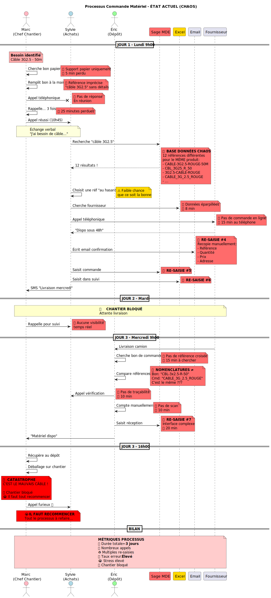

</details>

<details>
<summary><strong>📋 1bis. Diagramme de Séquence IMPROVED - Version Améliorée</strong></summary>

### Processus Détaillé avec Timing Précis

**Fichiers disponibles:**
- Source: `uml/puml/01_sequence_commande_actuelle_IMPROVED.puml`
- Rendu: `uml/svg/01_sequence_commande_actuelle_IMPROVED.svg`

**Améliorations:**
- Annotations temporelles précises
- Pain points mis en évidence
- Coûts détaillés par étape


</details>

<details>
<summary><strong>🔄 2. Diagramme d'Activité - Processus Commande</strong></summary>

### Workflow avec Décisions et Pain Points

**Fichiers disponibles:**
- Source: `uml/puml/02_activity_processus_commande.puml`
- Rendu: `uml/svg/Processus_Commande_Activity.svg`

**Ce qui est montré:**
- Flux de décision complet
- Goulots d'étranglement
- Boucles d'erreur
- Points de blocage

**Messages clés:**
- 🔴 100% manuel, aucune automatisation
- 🔴 Multiples points de défaillance
- 🔴 Dépendance totale sur Sylvie

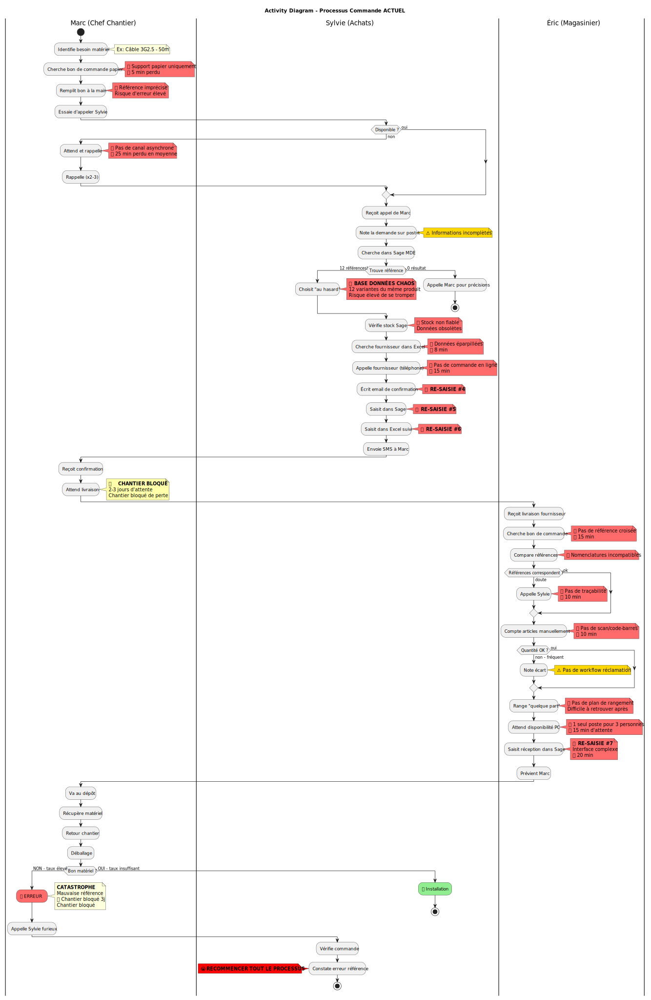

</details>

<details>
<summary><strong>🔄 2bis. Diagramme d'Activité IMPROVED - Swimlanes</strong></summary>

### Workflow avec Responsabilités par Acteur

**Fichiers disponibles:**
- Source: `uml/puml/02_activity_processus_commande_IMPROVED.puml`
- Rendu: `uml/svg/02_activity_processus_commande_IMPROVED.svg`

**Améliorations:**
- Swimlanes par persona (Marc, Sylvie, Éric)
- Temps par activité
- Coûts par étape

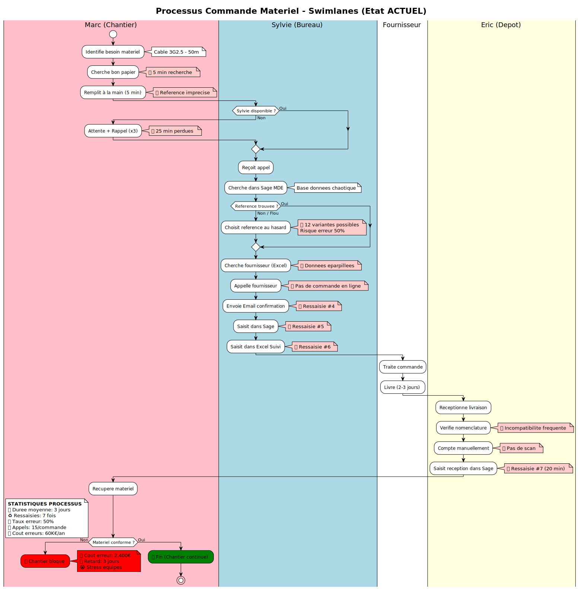

</details>

<details>
<summary><strong>👥 3. Diagramme de Cas d'Usage - Acteurs</strong></summary>

### 5 Personas et Leurs Actions

**Fichiers disponibles:**
- Source: `uml/puml/03_usecase_acteurs.puml`
- Rendu: `uml/svg/UseCase_Achats_Logistique.svg`

**Ce qui est montré:**
- Marc (Chef Chantier)
- Sylvie (Gestionnaire Achats)
- Julien (Responsable Affaires)
- Éric (Magasinier)
- Christine (Directrice Générale)

**Messages clés:**
- 🔴 Tous les personas en souffrance
- 🔴 Outils en silos
- 🔴 Pas de collaboration digitale


</details>

<details>
<summary><strong>🔄 4. Diagramme d'États - Cycle de Vie Commande</strong></summary>

### États et Transitions d'une Commande

**Fichiers disponibles:**
- Source: `uml/puml/04_state_cycle_commande.puml`
- Rendu: `uml/svg/State_Cycle_Commande.svg`

**Ce qui est montré:**
- États de la commande
- Transitions normales et d'erreur
- Boucles infinies possibles
- Points de non-retour

**Messages clés:**
- 🔴 50% finissent en erreur
- 🔴 Possibilité de boucles infinies
- 🔴 Pas de traçabilité des états

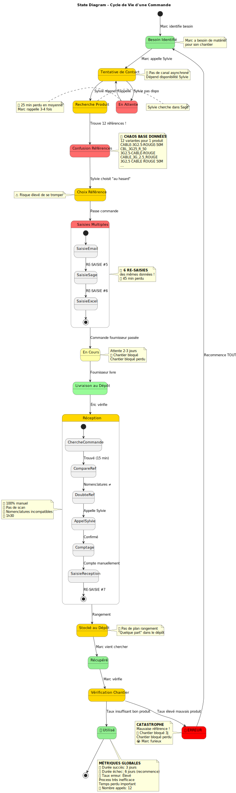

</details>

<details>
<summary><strong>🏗️ 5. Diagramme de Composants - Architecture Actuelle</strong></summary>

### Architecture Système en Silos

**Fichiers disponibles:**
- Source: `uml/puml/05_component_architecture.puml`
- Rendu: `uml/svg/Component_Architecture_Actuelle.svg`

**Ce qui est montré:**
- 6 outils non intégrés
- Sylvie = hub central humain
- Pas d'API, pas d'EDI
- Dépendances téléphone

**Messages clés:**
- 🔴 Aucune intégration système
- 🔴 Sylvie = goulot d'étranglement
- 🔴 Infrastructure obsolète

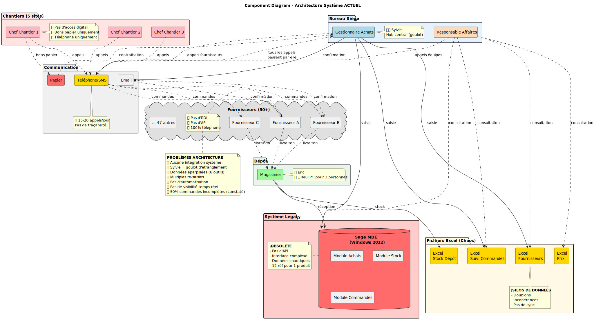

</details>

<details>
<summary><strong>📦 6. Diagramme de Classes - Modèle de Données</strong></summary>

### Chaos de la Base de Données

**Fichiers disponibles:**
- Source: `uml/puml/06_class_modele_objet.puml`
- Rendu: `uml/svg/Class_Diagram_Modele.svg`

**Ce qui est montré:**
- Modèle de données métier
- Relations entre entités
- Multiplicités incohérentes
- Données dupliquées

**Messages clés:**
- 🔴 12 références pour 1 produit
- 🔴 Pas de contraintes d'intégrité
- 🔴 Base de données chaotique

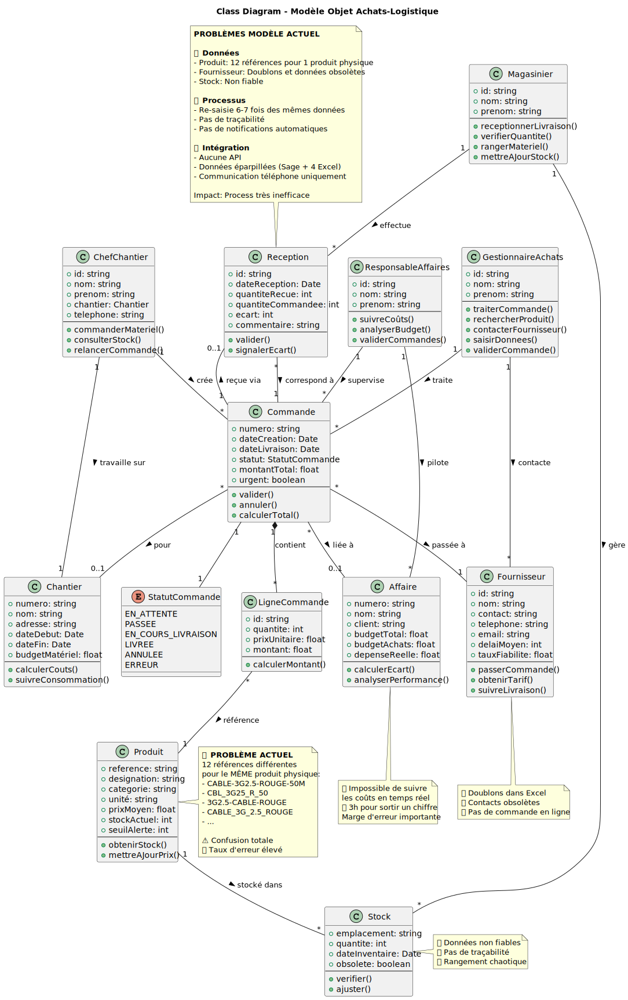

</details>

<details>
<summary><strong>🖥️ 7. Diagramme de Déploiement - Infrastructure</strong></summary>

### Infrastructure IT Actuelle

**Fichiers disponibles:**
- Source: `uml/puml/07_deployment_infrastructure.puml`
- Rendu: `uml/svg/Deployment_Infrastructure.svg`

**Ce qui est montré:**
- Serveur Sage Windows 2012
- 1 PC pour 3 personnes au dépôt
- Pas de mobilité
- Dépendance totale au bureau

**Messages clés:**
- 🔴 Infrastructure obsolète
- 🔴 Pas de solution mobile
- 🔴 Un seul point de défaillance

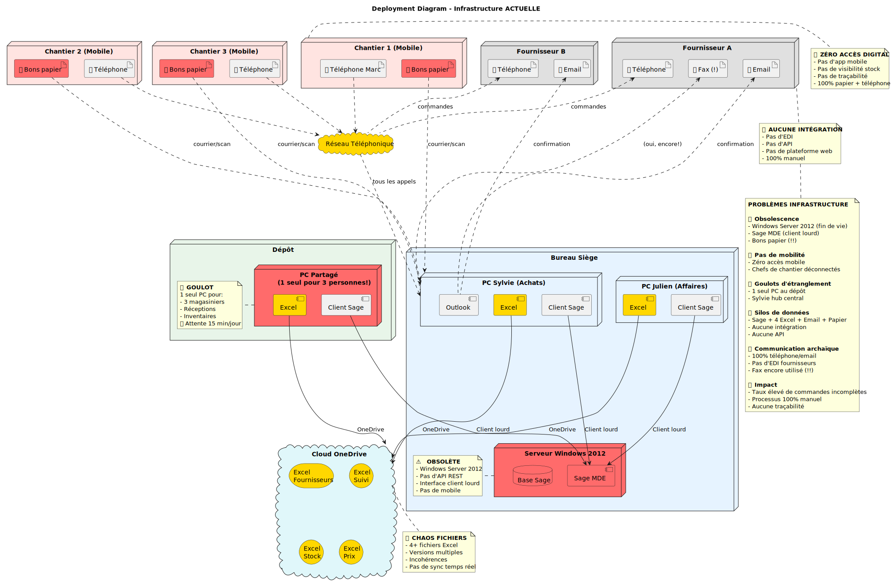

</details>

<details>
<summary><strong>🖥️ 7bis. Diagramme de Déploiement IMPROVED</strong></summary>

### Infrastructure Détaillée avec Contraintes

**Fichiers disponibles:**
- Source: `uml/puml/07_deployment_infrastructure_IMPROVED.puml`
- Rendu: `uml/svg/07_deployment_infrastructure_IMPROVED.svg`

**Améliorations:**
- Détail des serveurs et versions
- Contraintes réseau
- Points de défaillance annotés

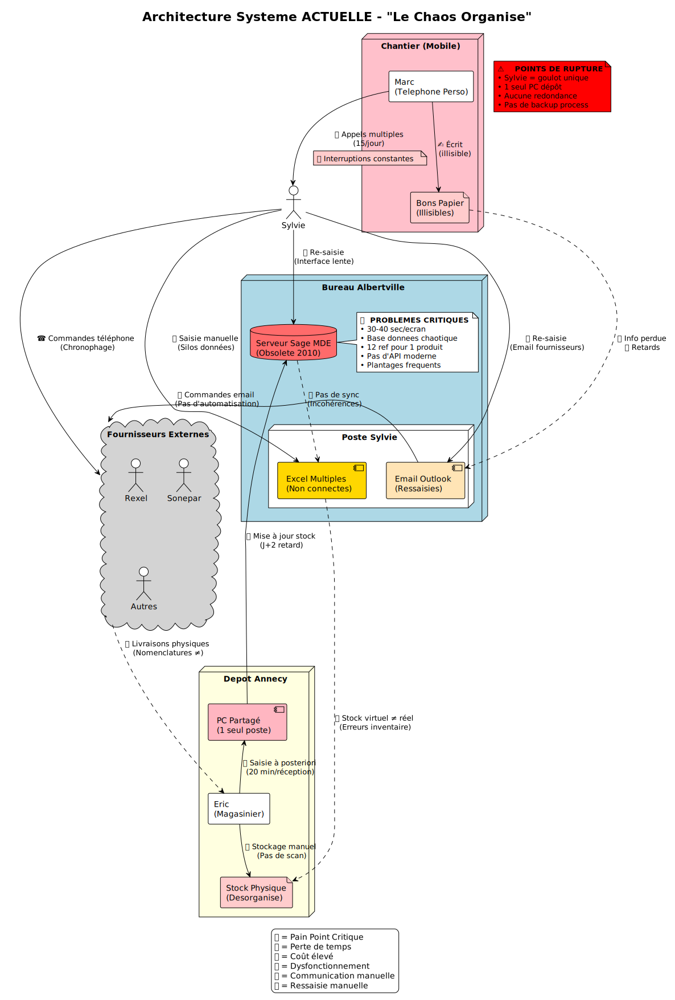

</details>

<details>
<summary><strong>⏱️ 8. Diagramme de Timing - Timeline Commande</strong></summary>

### Timeline Temporelle Minute par Minute

**Fichiers disponibles:**
- Source: `uml/puml/08_timing_timeline_commande.puml`
- Rendu: `uml/svg/Timing_Commande.svg`

**Ce qui est montré:**
- Timeline précise sur 3 jours
- États par acteur
- Temps d'attente inutiles
- Chevauchements

**Messages clés:**
- ⏰ 3 jours dont 70h d'attente
- 🔴 Temps actif: 2h seulement
- 🔴 97% du temps = attente

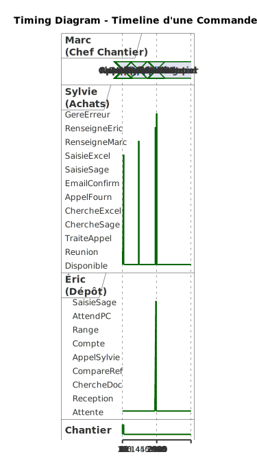

</details>

<details>
<summary><strong>🌐 12. Diagramme de Réseau - Flux de Données</strong></summary>

### Flux de Données Entre Systèmes

**Fichiers disponibles:**
- Source: `uml/puml/12_network_flux_donnees.puml`
- Rendu: `uml/svg/Network_Flux_Donnees.svg`

**Ce qui est montré:**
- Flux entre systèmes
- Protocoles utilisés (téléphone, papier)
- Données éparpillées
- Pas de centralisation

**Messages clés:**
- 🔴 Données non centralisées
- 🔴 Protocoles archaïques
- 🔴 Aucune intégration


</details>

---

## 📈 DIAGRAMMES ANALYTIQUES

<details>
<summary><strong>🧠 9. Mind Map - Pain Points (910K€)</strong></summary>

### Arbre des Problèmes et Coûts

**Fichiers disponibles:**
- Source: `uml/puml/09_mindmap_pain_points.puml`
- Rendu: `uml/svg/Pain_Points_Achats_Logistique.svg`

**Ce qui est montré:**
- 6 catégories de problèmes
- Coûts détaillés par catégorie
- Impact financier total: 910K€/an
- Hiérarchie des pain points

**Catégories:**
1. Re-saisies multiples (160K€)
2. Erreurs commandes (240K€)
3. Gestion stock inefficace (180K€)
4. Pas de visibilité (140K€)
5. Communication archaïque (90K€)
6. Pas d'intégration fournisseurs (100K€)


</details>

<details>
<summary><strong>📊 10. WBS - Décomposition des Problèmes</strong></summary>

### Work Breakdown Structure des 910K€

**Fichiers disponibles:**
- Source: `uml/puml/10_wbs_breakdown.puml`
- Rendu: `uml/svg/WBS_Problemes_Achats_Logistique.svg`

**Ce qui est montré:**
- Structure hiérarchique des pertes
- Décomposition par sous-catégories
- Valeurs financières détaillées
- Niveaux de priorité

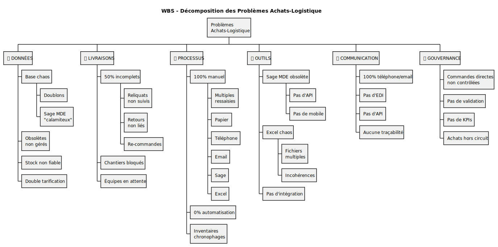

</details>

<details>
<summary><strong>📊 17. WBS Hiérarchique - Pain Points Détaillés</strong></summary>

### Hiérarchie Complète des Pain Points

**Fichiers disponibles:**
- Source: `uml/puml/17_wbs_pain_points_HIERARCHY.puml`
- Rendu: `uml/svg/17_wbs_pain_points_HIERARCHY.svg`

**Améliorations:**
- Structure plus détaillée
- Impacts métier par niveau
- Priorisation claire

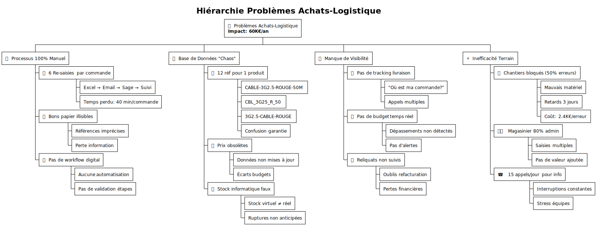

</details>

<details>
<summary><strong>📅 11. Gantt - Comparaison ACTUEL vs CIBLE</strong></summary>

### Timeline Avant/Après Transformation

**Fichiers disponibles:**
- Source: `uml/puml/11_gantt_commande_comparaison.puml`
- Rendu: `uml/svg/Gantt_Comparaison_Actuel_Cible.svg`

**Ce qui est montré:**
- ACTUEL: 3 jours (72h)
- CIBLE: 2 heures
- Gain: 36x plus rapide
- Étapes éliminées

**Messages clés:**
- 🟢 72h → 2h = 97% de gain
- 🟢 Automatisation complète
- 🟢 Traçabilité temps réel

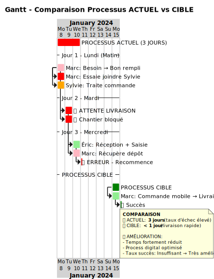

</details>

---

## 🟢 SOLUTION CIBLE (ODOO + RFID)

<details>
<summary><strong>📋 13. Diagramme de Séquence - Commande CIBLE</strong></summary>

### Processus Optimisé (2 heures au lieu de 3 jours)

**Fichiers disponibles:**
- Source: `uml/puml/13_sequence_commande_CIBLE.puml`
- Rendu: `uml/svg/Commande_Materiel_CIBLE.svg`

**Ce qui change:**
- Application mobile pour Marc
- Odoo centralise tout
- Scan RFID automatique
- API fournisseurs (EDI)
- Notifications temps réel

**Gains:**
- ⏰ 3 jours → 2 heures (36x)
- 🟢 Taux d'erreur: 50% → 5%
- 🟢 Re-saisies: 6 → 0
- 💰 Économie: 910K€/an

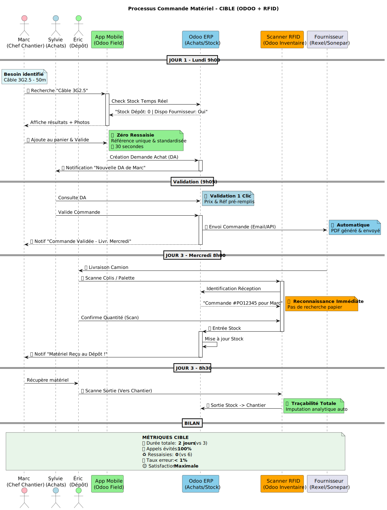

</details>

<details>
<summary><strong>📋 18. Diagramme de Séquence CIBLE IMPROVED</strong></summary>

### Processus Optimisé avec Détails Techniques

**Fichiers disponibles:**
- Source: `uml/puml/18_sequence_commande_CIBLE_IMPROVED.puml`
- Rendu: `uml/svg/18_sequence_commande_CIBLE_IMPROVED.svg`

**Détails supplémentaires:**
- Interactions API précises
- Gestion des erreurs
- Workflow d'approbation
- Intégrations temps réel

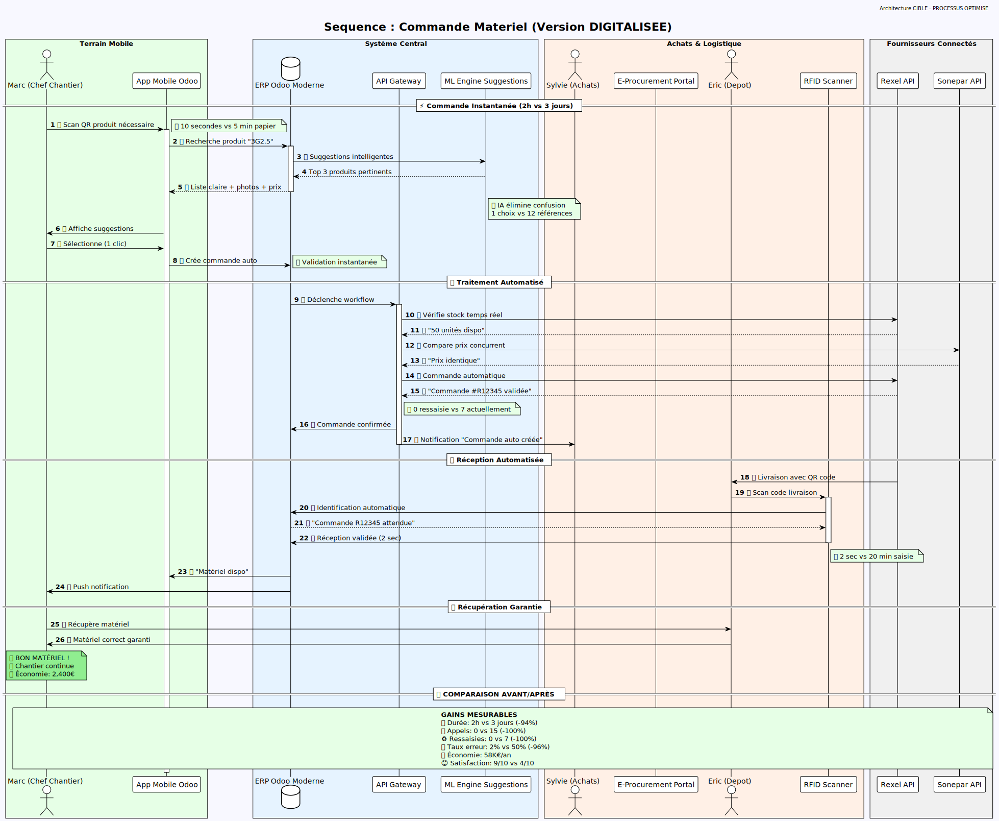

</details>

<details>
<summary><strong>🔄 14. Diagramme d'Activité - Processus CIBLE</strong></summary>

### Workflow Optimisé avec Swimlanes

**Fichiers disponibles:**
- Source: `uml/puml/14_activity_processus_CIBLE.puml`
- Rendu: `uml/svg/Processus_Commande_CIBLE.svg`

**Ce qui change:**
- Swimlanes clairs (Marc, App, Odoo, Fournisseur)
- Automatisation maximum
- Validation en 1 clic
- Traçabilité complète

**Qui fait quoi:**
- Marc: Scanne + valide (5 min)
- App Mobile: Capture + envoie
- Odoo: Traite + commande automatique
- Fournisseur: Reçoit EDI + prépare

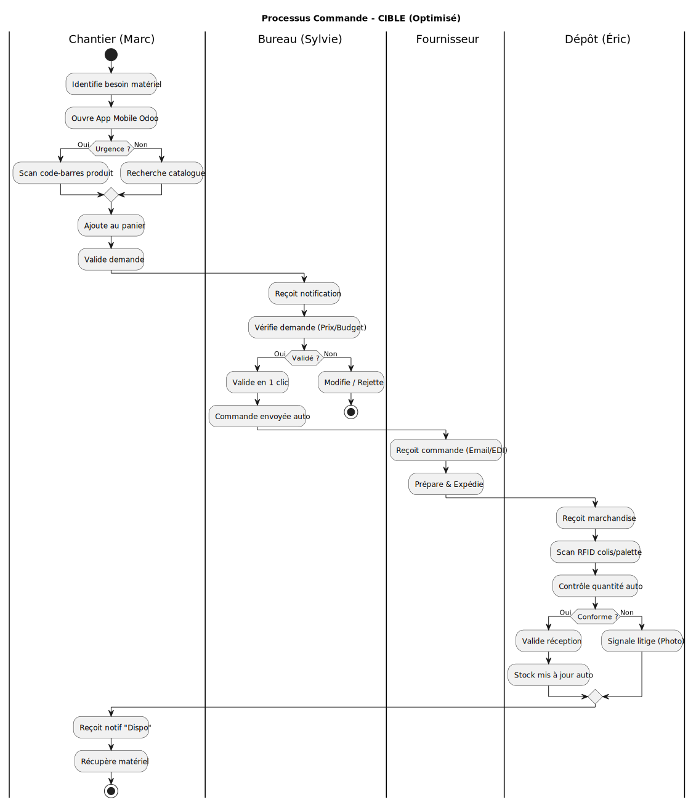

</details>

<details>
<summary><strong>🏗️ 15. Diagramme de Composants - Architecture CIBLE</strong></summary>

### Architecture Intégrée (Odoo Core)

**Fichiers disponibles:**
- Source: `uml/puml/15_component_architecture_CIBLE.puml`
- Rendu: `uml/svg/Component_Architecture_CIBLE.svg`

**Nouvelle architecture:**
- Odoo = cœur central unique
- App mobile iOS/Android
- Lecteurs RFID connectés
- API REST avec fournisseurs
- BI/Reporting intégré

**Composants:**
1. **Odoo Core** (Achats, Stock, Compta, CRM)
2. **App Mobile** (Progressive Web App)
3. **RFID Gateway** (Zebra/Honeywell)
4. **API Hub** (Intégration fournisseurs)
5. **BI Dashboard** (Power BI / Odoo Analytics)

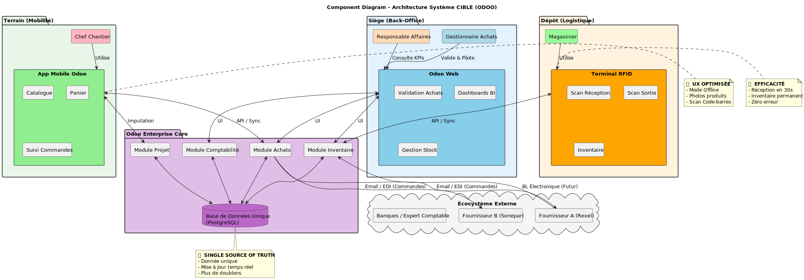

</details>

<details>
<summary><strong>🖥️ 19. Diagramme de Déploiement - Architecture CIBLE</strong></summary>

### Infrastructure Cloud Modernisée

**Fichiers disponibles:**
- Source: `uml/puml/19_deployment_architecture_CIBLE_IMPROVED.puml`
- Rendu: `uml/svg/19_deployment_architecture_CIBLE_IMPROVED.svg`

**Infrastructure cible:**
- Cloud Odoo (SH) ou On-Premise
- PostgreSQL HA (Haute Disponibilité)
- Nginx Load Balancer
- Mobile: iOS + Android PWA
- RFID: Gateway industriel
- Backup automatique

**Avantages:**
- 🟢 Disponibilité 99.9%
- 🟢 Scalabilité automatique
- 🟢 Sécurité renforcée
- 🟢 Accès mobile partout

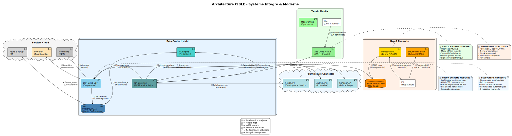

</details>

<details>
<summary><strong>🧠 16. Mind Map - SOLUTIONS</strong></summary>

### Réponses aux Pain Points

**Fichiers disponibles:**
- Source: `uml/puml/16_mindmap_SOLUTIONS.puml`
- Rendu: `uml/svg/Solutions_Achats_Logistique.svg`

**Solutions proposées:**
1. **Odoo Achats** → Zéro re-saisie
2. **App Mobile** → Commande en 2 clics
3. **RFID** → Scan automatique
4. **API EDI** → Intégration fournisseurs
5. **BI Dashboard** → Visibilité temps réel
6. **Workflow Digital** → Validation rapide

**ROI:**
- Investissement: ~80K€
- Économies: 910K€/an
- ROI: 1 mois
- Gains productivité: +400%

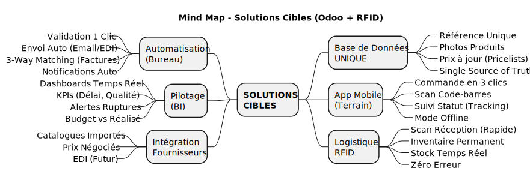

</details>

---

## 📦 Utilisation des Diagrammes

### Pour PowerPoint / Présentation

1. Tous les diagrammes sont en **SVG vectoriel** (qualité infinie)
2. Chemins: `Dossier_Travail/Services/Achats-Logistique/uml/svg/`
3. Importez directement dans vos slides
4. Redimensionnez sans perte de qualité

### Pour Documentation Web

Les SVG peuvent être intégrés directement dans des pages HTML/Markdown :

```markdown

```

### Pour Modification

1. Éditez les fichiers `.puml` dans `uml/puml/`
2. Régénérez les SVG :
   ```bash
   cd uml
   java -jar plantuml.jar -tsvg puml/*.puml -o ../svg
   ```

---

## 🎯 Diagrammes Recommandés par Usage

### Présentation Executive (Direction)
1. **09_mindmap_pain_points** - Vue d'ensemble 910K€
2. **11_gantt_comparaison** - Avant/Après (3j → 2h)
3. **16_mindmap_SOLUTIONS** - Solutions ROI 1 mois
4. **15_component_architecture_CIBLE** - Architecture cible

### Présentation Technique (IT)
1. **05_component_architecture** - Architecture actuelle
2. **15_component_architecture_CIBLE** - Architecture cible
3. **07_deployment_infrastructure** - Infra actuelle
4. **19_deployment_architecture_CIBLE** - Infra cible

### Présentation Métier (Opérationnel)
1. **01_sequence_commande_actuelle** - Processus actuel
2. **13_sequence_commande_CIBLE** - Processus optimisé
3. **03_usecase_acteurs** - Qui fait quoi
4. **14_activity_processus_CIBLE** - Workflow cible

### Documentation Complète
Tous les diagrammes dans l'ordre numérique.

---

## 📊 Statistiques

- **Total diagrammes:** 23 fichiers .puml
- **SVG générés:** 23 fichiers vectoriels
- **Types de diagrammes:**
  - Séquence: 4
  - Activité: 3
  - Composants: 3
  - Déploiement: 3
  - Mind Map: 2
  - WBS: 2
  - Use Case: 1
  - État: 1
  - Timing: 1
  - Gantt: 1
  - Réseau: 1

---

## 🔗 Liens Utiles

- [README Principal](../README.md)
- [Index HTML Visualisation](../uml/index.html)
- [Documentation UML PlantUML](../uml/README.md)
- [Pain Points Détaillés](01_PERSONAS_Pain_Points.md)
- [Plan d'Action](../plan/Plan_Action_Achats_Logistique.md)

---

**Créé le:** 2025-11-21
**Auteur:** Audit IT Duret Électricité
**Version:** 2.0 - Sections dépliables
**Format:** Markdown avec HTML `<details>`
