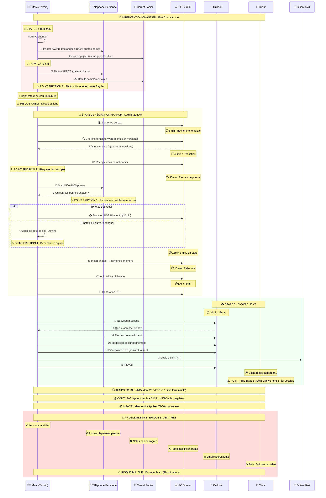
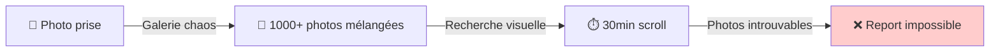
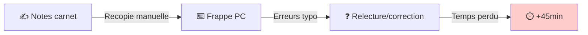
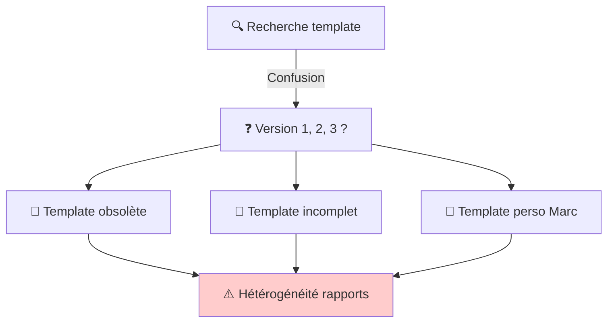
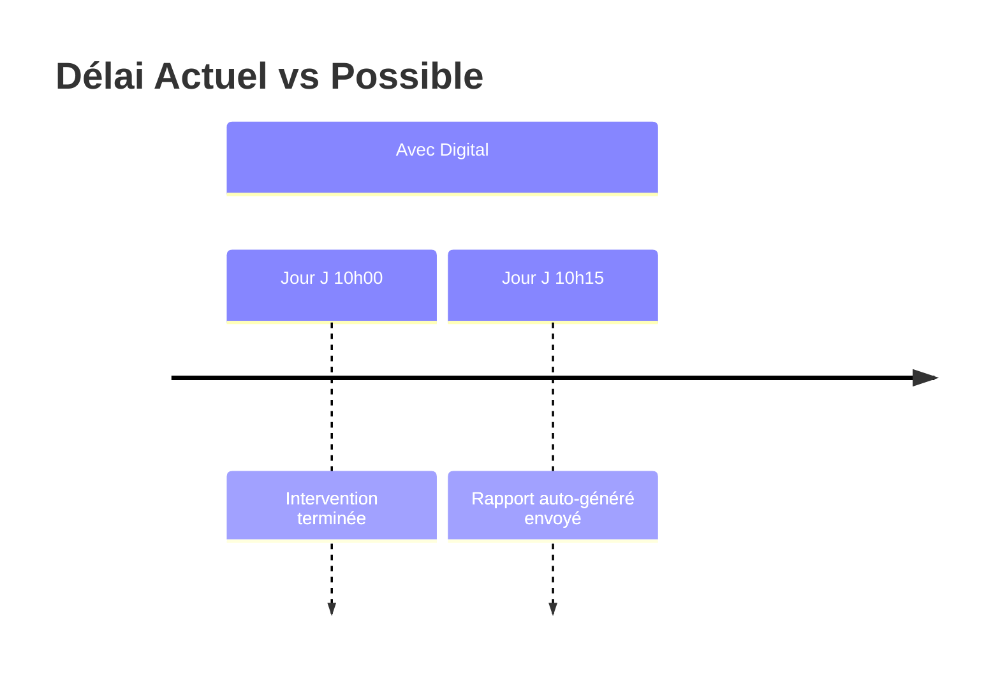
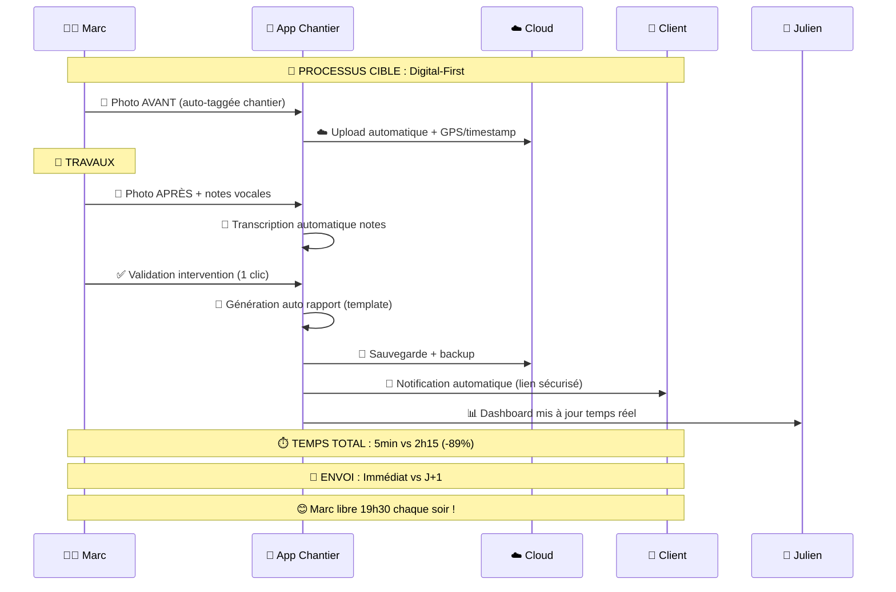

# 📊 DIAGRAMME PROCESSUS ACTUEL - Rapport d'Intervention

## 🔄 Séquence Complète : De l'Intervention au Rapport Client

## 🎯 Analyse des Points de Friction

### 🔴 FRICTION 1 : Photos Dispersées (30min/rapport)

### 🔴 FRICTION 2 : Recopie Manuelle (45min/rapport)

### 🔴 FRICTION 3 : Templates Incohérents

### 🔴 FRICTION 4 : Délai Client (J+1)

## 📊 Métriques d'Inefficacité Actuelles

| Phase | Temps Actuel | Temps Optimal | Gaspillage |
|-------|--------------|---------------|------------|
| 📸 **Photos** | 30min recherche | 2min (app organisée) | **-93%** |
| ✍️ **Rédaction** | 45min recopie | 5min (saisie directe) | **-89%** |
| 🖼️ **Mise en page** | 15min manuel | Auto (template) | **-100%** |
| 📧 **Envoi** | 10min email lourd | Auto (notification) | **-100%** |
| **TOTAL** | **2h15/rapport** | **15min/rapport** | **-89%** |

## 🎯 Vision Cible : Processus Digitalisé

---

**💡 Conclusion :** Le processus actuel **GASPILLE 89% du temps** et **ÉPUISE** les équipes. La digitalisation permettrait de **LIBÉRER Marc** et d'offrir un **service client temps réel**.