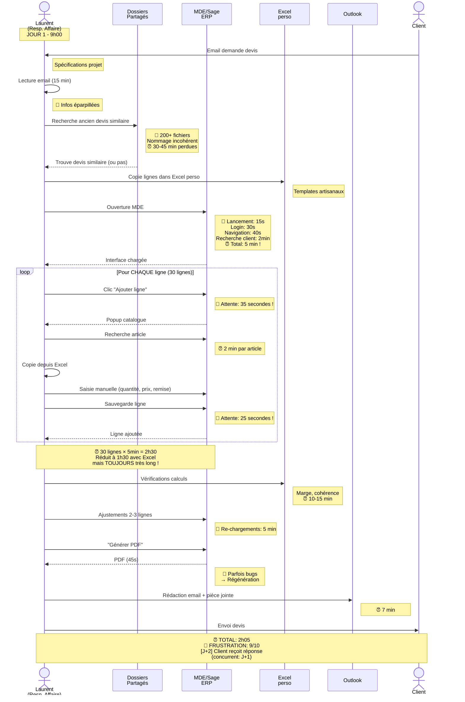
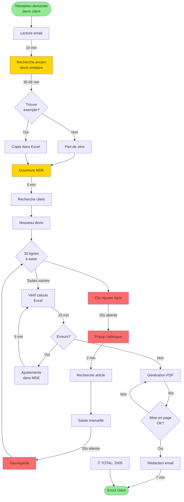
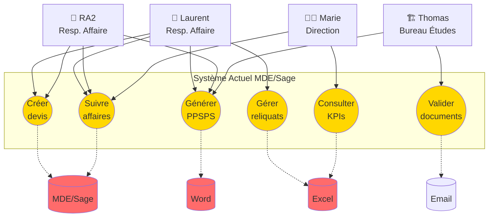
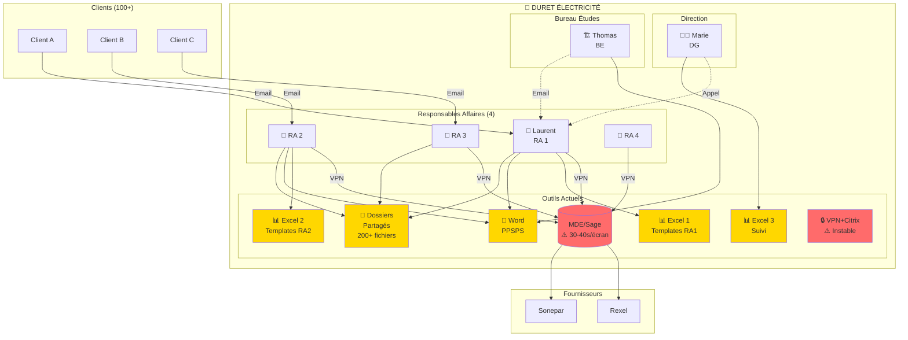
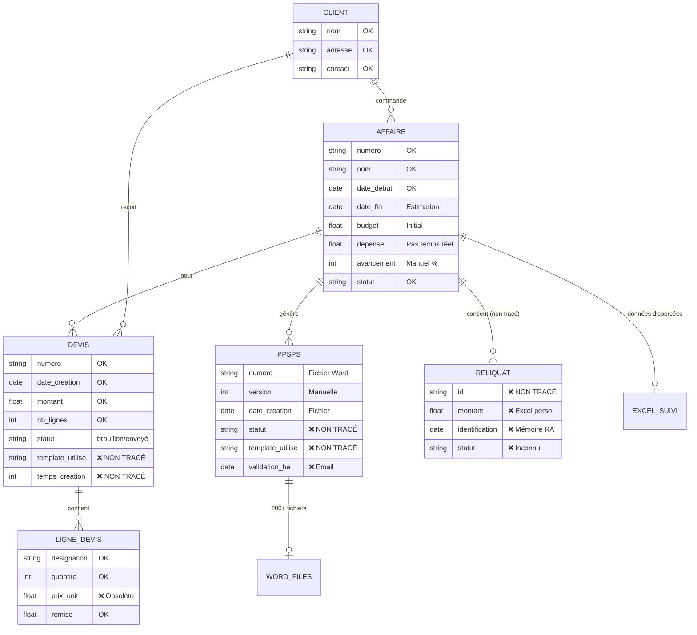
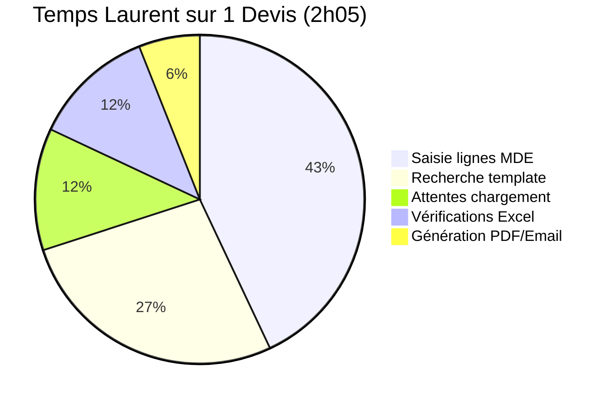
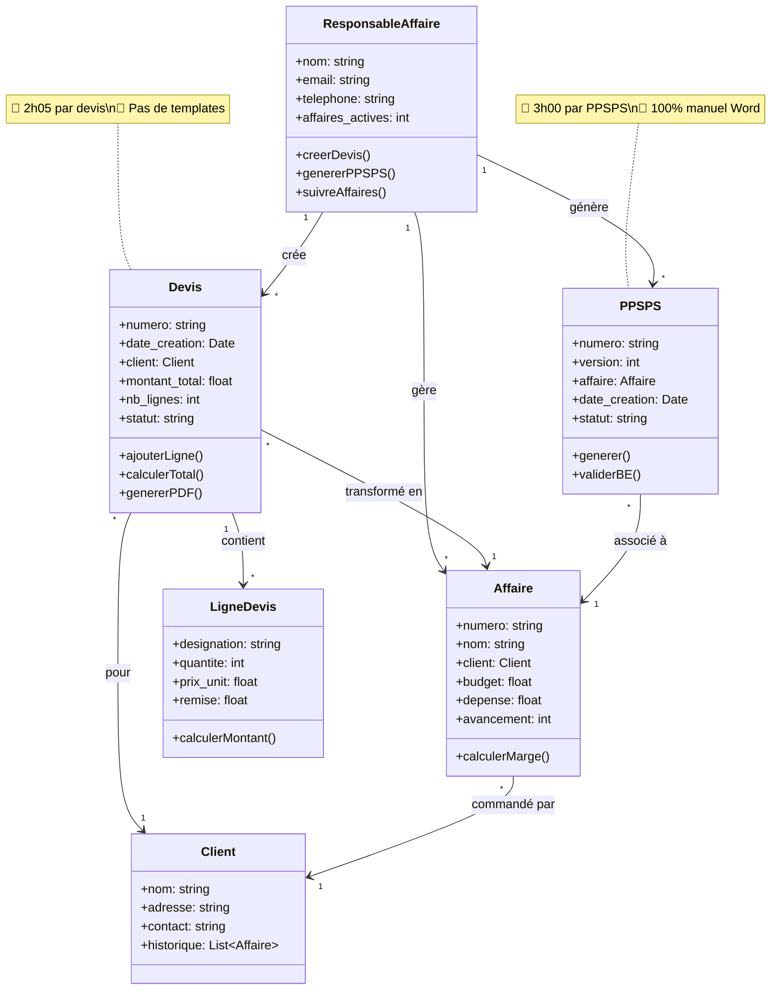
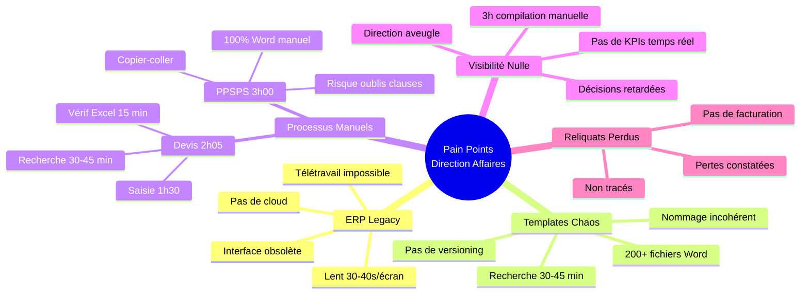

# 🎨 DIAGRAMMES UML - Direction & Gestion Affaires

> Diagrammes visuels pour présentation slides
> Format: Mermaid (rendu graphique)

---

## 1. Diagramme de Séquence: Création Devis (État ACTUEL)



---

## 2. Activity Diagram: Processus Création Devis ACTUEL



---

## 3. Use Case Diagram: Acteurs et Actions



---

## 4. State Diagram: Cycle de Vie d'un Devis

```mermaid
stateDiagram-v2
    [*] --> Demande: Client demande devis

    Demande --> Recherche: Laurent cherche template

    Recherche --> EnAttente: Template introuvable
    EnAttente --> Recherche: Continue recherche (30 min)

    Recherche --> Brouillon: Ouvre MDE (5 min)

    Brouillon --> Saisie: Débute saisie lignes
    note right of Saisie: 🔴 1h30 de saisie<br/>30 lignes × 5 min

    Saisie --> Verification: Vérif Excel

    Verification --> Ajustements: Erreurs détectées
    Ajustements --> Verification: Re-calcul

    Verification --> Generation: Calculs OK

    Generation --> BugPDF: Mise en page défaillante
    BugPDF --> Generation: Régénération

    Generation --> Envoi: PDF OK

    Envoi --> Envoye: Client reçoit (J+2)

    Envoye --> Accepte: Client accepte
    Envoye --> Refuse: Client refuse
    Envoye --> EnAttente2: Pas de réponse (>10j)

    Accepte --> [*]: Affaire créée
    Refuse --> [*]: Archivé
    EnAttente2 --> Relance: RA relance client

    note left of Brouillon: ⏰ Total: 2h05<br/>😤 Frustration: 9/10
```

---

## 5. Component Diagram: Architecture Système ACTUEL



---

## 6. ERD: Modèle de Données Actuel



---

## 7. Pie Chart: Répartition du Temps (Laurent - Création Devis)



---

## 8. Gantt: Timeline Création Devis

```mermaid
gantt
    title Création Devis Client: Timeline ACTUELLE
    dateFormat HH:mm
    axisFormat %Hh%M

    section Préparation
    Lecture email client        :done, p1, 09:00, 15m
    Recherche ancien devis      :crit, p2, after p1, 35m
    Copie lignes Excel          :done, p3, after p2, 5m

    section Ouverture MDE
    Lancement MDE               :crit, o1, after p3, 15s
    Login                       :crit, o2, after o1, 30s
    Navigation menu             :crit, o3, after o2, 40s
    Recherche client            :crit, o4, after o3, 2m
    Nouveau devis               :crit, o5, after o4, 40s

    section Saisie (1h30)
    Saisie 30 lignes            :crit, s1, after o5, 90m

    section Vérifications
    Vérif calculs Excel         :done, v1, after s1, 15m
    Ajustements MDE             :crit, v2, after v1, 5m

    section Finalisation
    Génération PDF              :crit, f1, after v2, 3m
    Rédaction email             :done, f2, after f1, 7m
    Envoi                       :done, f3, after f2, 1m
```



---

## 9. Class Diagram: Modèle Objet (Simplifié)



---

## 10. Deployment Diagram: Infrastructure Actuelle

```mermaid
graph TB
    subgraph "Bureau + Télétravail"
        PC1[💻 PC Laurent<br/>Bureau]
        PC2[💻 PC Laurent<br/>Domicile]
        PC3[💻 PC RA2]
        PC4[💻 PC RA3]
    end

    subgraph "Serveurs Internes"
        Sage[🖥️ Serveur MDE/Sage<br/>Windows Server]
        FileServer[📁 Serveur Fichiers<br/>Dossiers Partagés]
    end

    subgraph "Accès Distant"
        VPN[🔒 VPN Entreprise<br/>⚠️ Instable]
        Citrix[☁️ Citrix Virtual Desktop<br/>⚠️ 30-40s/écran]
    end

    subgraph "Cloud"
        Email[📧 Outlook<br/>Office 365]
    end

    subgraph "Clients"
        Clients[👥 Clients<br/>Email/Téléphone]
    end

    PC1 --> Sage
    PC1 --> FileServer
    PC3 --> Sage
    PC4 --> Sage

    PC2 -.->|VPN| VPN
    VPN -.->|Citrix| Citrix
    Citrix -.-> Sage
    Citrix -.-> FileServer

    PC1 --> Email
    PC2 --> Email
    PC3 --> Email

    Email <-.-> Clients

    style Sage fill:#FF6B6B
    style VPN fill:#FF6B6B
    style Citrix fill:#FF6B6B
    style FileServer fill:#FFD700
```

---

## 11. Mind Map: Pain Points Hiérarchisés



---

## 12. Comparison Bar Chart: AVANT vs APRÈS

```mermaid
---
config:
  themeVariables:
    xyChart:
      backgroundColor: "white"
---
xychart-beta
    title "Comparaison Temps Processus: AVANT vs APRÈS"
    x-axis [Ouverture système, Création devis, Génération PPSPS, Visibilité direction]
    y-axis "Temps (minutes)" 0 --> 180
    bar [5, 125, 180, 180]
    bar [0.5, 31, 27, 2]
```

---

**LÉGENDE**

🔴 = Pain Point CRITIQUE
🟠 = Pain Point IMPORTANT
🟢 = Pain Point SOUHAITÉ
⏰ = Temps perdu
❌ = Erreur
😤 = Frustration utilisateur
